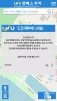
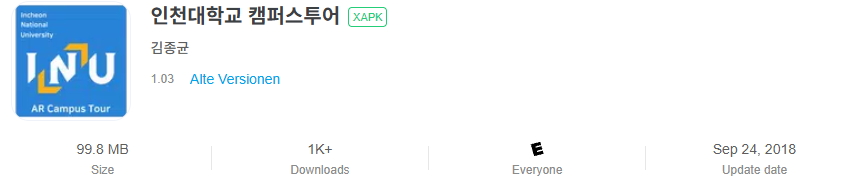
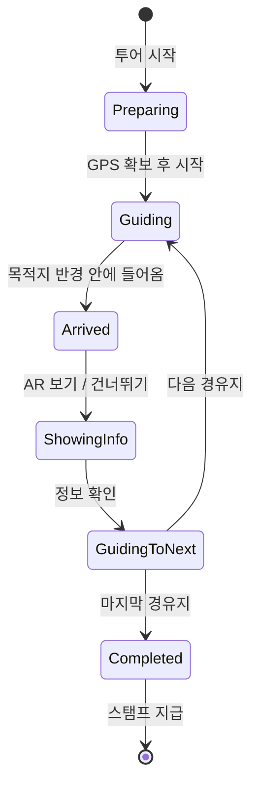

# 인천대학교 캠퍼스투어 (INU AR Campus Tour)

졸업 작품으로 인천대학교 대외협력홍보팀과 함께 만든 **증강현실(AR) 캠퍼스 투어·홍보 앱**입니다.
Google Play에 출시해 실제 사용자를 대상으로 운영했고, 이 저장소는 포트폴리오를 위해 예전 프로젝트를 이식한 것입니다.
3인 팀 프로젝트이며 저는 이 프로젝트에서 클라이언트 개발을 맡았었습니다.

> 현재는 서비스가 종료되어 Google Play에서 내려간 상태입니다.

<p>
  
  &nbsp;
  
</p>

*왼쪽: 캠퍼스 지도 · 검색 / 오른쪽: GPS 투어(60분 코스) 시작*

<details>
<summary>출시 기록</summary>



</details>

---

## 주요 기능

| 기능 | 설명 |
|---|---|
| **캠퍼스 지도 · 검색** | 학교, 학과, 건물 검색. 마커를 누르면 종류(포토존·촬영지·맛집·식당)에 맞는 상세 화면이 열림 |
| **GPS 투어 코스 5종** | 60분 · 30분 · 드라마 촬영지 · 인문사회계열 · 이공계열 코스. 현재 위치로 시작 지점을 고르고, 경로를 안내하고, 도착을 판정함 |
| **AR 콘텐츠** | Vuforia 기반 AR, GPS 기반 AR 이벤트(UFO) |
| **360° 로드뷰 (VR)** | 캠퍼스 70여 개 지점의 360° 이미지 사이를 이동하며 둘러보기 (Google VR) |
| **학교 정보** | 주요 시설 안내, 단과대 · 학과 안내, 커리큘럼 |
| **학식 메뉴** | 학교 홈페이지 식단 4곳을 실시간으로 파싱해서 표시 |
| **스탬프 투어** | 코스를 완주하면 스탬프 지급 |
| **미디어 · 포토존** | 캠퍼스 드라마 · 예능 촬영지, 포토존 사진 갤러리 |

---
### 1. 상태 머신으로 만든 투어 흐름
기존 코드는 bool 플래그 5개를 조합해서 투어 흐름을 제어했습니다. 이것을 **State 패턴**으로 다시 설계했습니다.
각 상태는 자신에게 의미 있는 입력만 처리하기 때문에, 잘못된 순서로 들어온 입력은 자동으로 무시됩니다.



- `Scripts/Tour/TourStateMachine.cs`, `Scripts/Tour/States/*`
- AR 씬에 들어갔다가 돌아와도 진행 상태가 유지됩니다(`TourSession`).

### 2. 데이터 기반 설계와 에디터 툴
- 코스 5종을 **`TourController` 하나 + ScriptableObject 데이터**(`Data/Tours/*.asset`)로 운영합니다. 기존에는 클래스 5벌에 값이 하드코딩되어 있었습니다.
- **`TourSetupValidator`**(메뉴 `CampusTour > Validate Tours`)는 코스 데이터와 씬 · 지도 프리팹이 서로 맞는지 자동으로 검사합니다.
  - 검사 항목: 경유지 수와 정보 패널 수, 마커 수, 버튼 이벤트 연결
  - 배치 모드(`-executeMethod`)로도 실행되어 CI에 붙일 수 있습니다.

### 3. 모바일 메모리 · 리소스 관리
- **`ImageLoader`**
  - 같은 이미지를 동시에 요청하면 요청 하나로 합칩니다.
  - 화면(scope) 단위로 텍스처를 해제합니다.
  - 화면이 닫힌 뒤 도착한 응답은 즉시 버려서 텍스처 누수를 막습니다.
- **`ObjectPool<T>`**: 목록 UI 항목을 재사용해서 반복 `Instantiate`와 GC 부담을 줄였습니다.

### 4. 네트워크 계층
- **`ApiClient`(Facade)**:
  - 타임아웃, 재시도, 오류 분류(네트워크 · 타임아웃 · HTTP)를 처리합니다.
  - 응답의 charset을 읽어 디코딩합니다. 학교 서버의 비 UTF-8 응답에 대응하기 위해서입니다.
- **학식 파서(Strategy)**: 식당마다 다른 HTML 형식을 파서 전략으로 분리했습니다. 식당이 추가되어도 전략 하나만 등록하면 됩니다.

### 5. 화면 내비게이션
- Additive 씬 기반의 **`ScreenNavigator` / `ScreenStack`**을 만들었습니다.
- 화면과 팝업(오버레이)을 하나의 스택으로 관리해서, Android 뒤로가기 버튼이 항상 가장 위의 요소부터 닫습니다.


## 프로젝트 구조

```
Assets/
├─ Scripts/
│  ├─ Core/        Singleton, ObjectPool, GeoUtil
│  ├─ Network/     ApiClient, ImageLoader, ResponseParser, Meal/(학식 파서)
│  ├─ UI/          ScreenNavigator, ScreenStack, 팝업
│  ├─ Map/         마커 분류 · 라우팅, 검색
│  ├─ Tour/        TourController, TourStateMachine, States/, 코스 데이터 모델
│  ├─ AR/          AR 진입 · 이벤트
│  ├─ RoadView/    360° 로드뷰
│  └─ Screens/     화면별 스크립트 (정보, 미디어, 포토존, 맛집, 스탬프 등)
├─ Editor/CampusTour/   TourSetupValidator
├─ Tests/Editor/        EditMode 테스트 (NUnit)
├─ Data/Tours/          코스 데이터 (ScriptableObject)
└─ Scene/               씬
```

---
